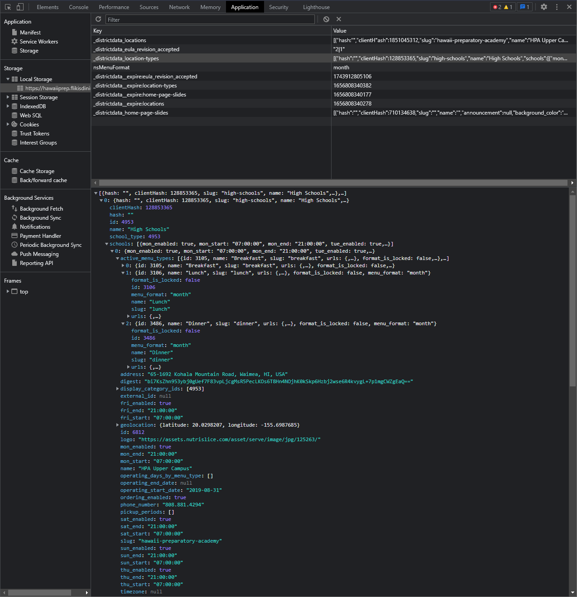
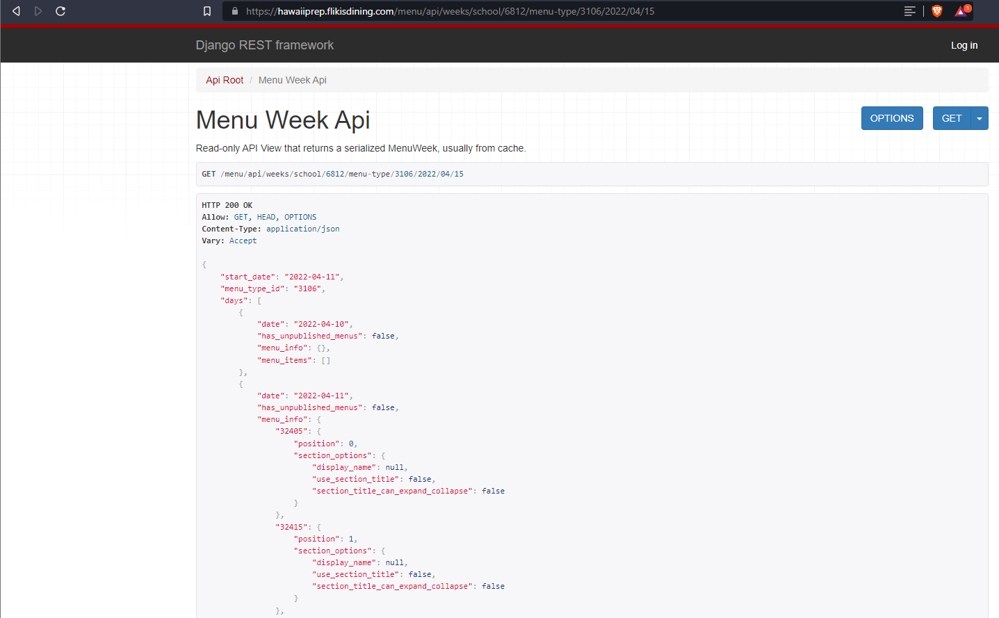

****A Python package for scraping and parsing Flik Menu Data for Hawai'i Preparatory Academy****

This package is designed to help integrate the menu service of Flik / Nutrislice with any 3rd party application that HPA cares to integrate it with by creating a couple helpful tools to pull and manage menu data.

Part of the difficulty in building this package was that there wasn't any documentation provided by Nutrislice. After having a couple emails back and forth with their IT people it became clear that they weren't going to give me access to the API links. 

I did some digging into the webpage that they create to serve the data to the school in a nice readable way. I discovered the API links in the webpages local storage on the client side browsing application. 


The image below shows the webpage that serves the data in which the python package requests from. 



#Documentation
The package can be installed using pip:

```
pip3 install hpa_menu
```
The package requires python 3.9 or higher. 
The package's only dependency is the **requests** package.
Pip should automatically resolve this though. 

**Importing into a python script**
The way I have found importing the package and its module to be most intuitive is to use:
```python
import hpa_menu.parse as parser
```

Then using the package to create a python dict object of the week's menu data can be as easy as:
```python
weeks_dictionary_data = parser.collect_week("YYYY-MM-DD")
```
The ```collect_week()``` and ```collect_month()``` function's take 1 required argument and 3 optional arguments. 
The ```date``` argument for the ```collect_week()``` function must be a string in the "YYYY/MM/DD" format. 

The optional arguments for the `collect_month()` function are:
`full_week=False(default)`: True will include a whole weeks data even if some days in the begginning or ending week doesn't occur in the given month. For example if Feb 1 is a thursday, the dataset will also include the Mon Tues Wed of the previous January. False will not include another month's data.
`nutrition_info=True(default)`: True will include all the nutritional info for each dish in the nested dictionary with "nutrition info" as the key
`ingredients=True(default)`: True will include all the ingrediends that Flik provides for each dish in the nested dictionary with "ingredients" as the key.

## Examples

```python
import hpa_menu.parse as parser

# Collect the week of April 11, 2022 menu data. Without ingredients or nutrition info. 
menu_data_dict = parser.collect_week("2022-04-11", ingredients=False, nutrition_info=False)
"""
{'2022-04-11': {'Entree/Sides': [{'name': 'Pork Loin with Mango Chutney'}, {'name': 'Steamed Whole Grain 5 Blend'}, {'name': 'Steamed Butternut Squash'}], 'Vegetarian': [{'name': 'Beyond Meatless Penne Bake'}, {'name': 'Roasted Broccoli, Parmesan'}], 'Pizza, Flatbreads': [{'name': 'Pepperoni Flatbread Pizza'}, {'name': 'Cheese Flatbread Pizza'}, {'name': 'Wild Mushroom Flatbread'}], 'Chefs Table': [{'name': 'Baked Potato'}, {'name': 'Bacon Bits'}, {'name': 'Shredded Cheddar Cheese'}, {'name': 'Sour Cream'}, {'name': 'Chopped Green Onions'}, {'name': 'Roasted Vegetables'}], 'Deli': [{'name': 'Potato Chips'}, {'name': 'Grilled Vegetables'}, {'name': 'Thinly Sliced Deli Turkey Breast'}, {'name': 'Meatless Burger'}, {'name': 'Sliced Provolone Cheese'}, {'name': 'Sliced Cheddar Cheese'}, 'Soup', {'name': 'Vegetable Miso Soup'}], 'Vegan': [{'name': 'Beyond Meatless Penne Bake'}, {'name': 'Roasted Broccoli, Parmesan'}]}, '2022-04-12': {'Entree/Sides': [{'name': 'Cheese Ravioli Pomodoro'}, {'name': 'Garlic, Cheese Bread'}, {'name': 'Zucchini, Squash, Herbs, Garlic'}], 'Vegetarian': [{'name': 'Cheese Ravioli Pomodoro'}, {'name': 'Zucchini, Squash, Herbs, Garlic'}], 'Pizza, Flatbreads': [{'name': 'Pepperoni Flatbread Pizza'}, {'name': 'Cheese Flatbread Pizza'}], 'Chefs Table': [{'name': 'Beef Lo Mein'}, {'name': 'Veggie Stir Fry'}, {'name': 'Vegetable Spring Roll'}, {'name': 'Jasmine Rice, Garbanzo, Radish Seeds'}], 'Deli': [{'name': 'Potato Chips'}, {'name': 'Grilled Vegetables'}, {'name': 'Thinly Sliced Deli Turkey Breast'}, {'name': 'Meatless Burger'}, {'name': 'Sliced Provolone Cheese'}, {'name': 'Sliced Cheddar Cheese'}, 'Soup', {'name': 'Vegetable Miso Soup'}], 'Vegan': [{'name': 'Pasta Vegetable Pomodoro'}, {'name': 'Zucchini, Squash, Herbs, Garlic'}]}, '2022-04-13': {'Entree/Sides': [{'name': 'Coconut Curry Rotisserie Chicken'}, {'name': 'Fried Brown Rice'}, {'name': 'Sesame Broccoli'}], 'Vegetarian': [{'name': 'Broccoli with Asian Tofu'}, {'name': 'Steamed Rice'}], 'Pizza, Flatbreads': [{'name': 'Pepperoni Flatbread Pizza'}, {'name': 'Cheese Flatbread Pizza'}, {'name': 'Mediterranean Grilled Flatbread'}], 'Chefs Table': [{'name': 'Ramen Noodles'}, {'name': 'Pad Thai Rice Noodles'}, {'name': 'Egg, Tofu, Ginger Miso Ramen Bowl'}, {'name': 'Pork Bely, Tonkotsu Ramen Bowl'}, {'name': 'Chopped Green Onions'}], 'Deli': [{'name': 'Potato Chips'}, {'name': 'Sliced Smoked Ham'}, {'name': 'Meatless Burger'}, {'name': 'Grilled Vegetables'}, {'name': 'Sliced Provolone Cheese'}, {'name': 'Sliced Cheddar Cheese'}, 'Soup', {'name': 'Vegetable Miso Soup'}], 'Vegan': [{'name': 'Broccoli with Asian Tofu'}, {'name': 'Steamed Rice'}]}, '2022-04-14': {'Entree/Sides': [{'name': 'BBQ Beef Brisket'}, {'name': 'Boiled New Potatoes, Parsley'}, {'name': 'Sauteed Chard with Mushrooms'}], 'Vegetarian': [{'name': 'Beyond Bratwurst, Sauerkraut, Roll'}], 'Pizza, Flatbreads': [{'name': 'Pepperoni Flatbread Pizza'}, {'name': 'Cheese Flatbread Pizza'}], 'Chefs Table': [{'name': 'Beef Sausage Bolognese Sauce'}, {'name': 'Penne Pasta'}, {'name': 'Marinara Sauce'}, {'name': 'Parmesan Herbed Garlic Bread'}, {'name': 'Shredded Parmesan Cheese'}, {'name': 'Chicken Caesar Salad'}], 'Deli': [{'name': 'Potato Chips'}, {'name': 'Grilled Vegetables'}, {'name': 'Grilled Chicken'}, {'name': 'Meatless Burger'}, {'name': 'Sliced Provolone Cheese'}, {'name': 'Sliced Cheddar Cheese'}, 'Soup', {'name': 'Vegetable Miso Soup'}], 'Vegan': [{'name': 'Beyond Bratwurst, Sauerkraut, Roll'}]}, '2022-04-15': {'Entree/Sides': [{'name': 'Potato Chips'}, {'name': 'Grilled Vegetables'}, {'name': 'Grilled Chicken'}, {'name': 'Meatless Burger'}, {'name': 'Sliced Provolone Cheese'}, {'name': 'Sliced Cheddar Cheese'}], 'Vegetarian': [], 'Pizza, Flatbreads': [], 'Chefs Table': [], 'Deli': [{'name': 'Potato Chips'}, {'name': 'Grilled Vegetables'}, {'name': 'Grilled Chicken'}, {'name': 'Meatless Burger'}, {'name': 'Sliced Provolone Cheese'}, {'name': 'Sliced Cheddar Cheese'}], 'Vegan': []}}
"""


# Find the vegan option for April 12th
day_menu = menu_data_dict["2022-04-12"]
"""
{'Entree/Sides': [{'name': 'Cheese Ravioli Pomodoro'}, {'name': 'Garlic, Cheese Bread'}, {'name': 'Zucchini, Squash, Herbs, Garlic'}], 'Vegetarian': [{'name': 'Cheese Ravioli Pomodoro'}, {'name': 'Zucchini, Squash, Herbs, Garlic'}], 'Pizza, Flatbreads': [{'name': 'Pepperoni Flatbread Pizza'}, {'name': 'Cheese Flatbread Pizza'}], 'Chefs Table': [{'name': 'Beef Lo Mein'}, {'name': 'Veggie Stir Fry'}, {'name': 'Vegetable Spring Roll'}, {'name': 'Jasmine Rice, Garbanzo, Radish Seeds'}], 'Deli': [{'name': 'Potato Chips'}, {'name': 'Grilled Vegetables'}, {'name': 'Thinly Sliced Deli Turkey Breast'}, {'name': 'Meatless Burger'}, {'name': 'Sliced Provolone Cheese'}, {'name': 'Sliced Cheddar Cheese'}, 'Soup', {'name': 'Vegetable Miso Soup'}], 'Vegan': [{'name': 'Pasta Vegetable Pomodoro'}, {'name': 'Zucchini, Squash, Herbs, Garlic'}]}
"""


vegan_option = day_menu["Vegan"]
"""
[{'name': 'Pasta Vegetable Pomodoro'}, {'name': 'Zucchini, Squash, Herbs, Garlic'}]
"""


```